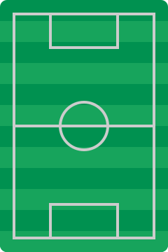

Credits
===

All artwork and third-party assets used in this project are credited to their respective creators below. I'm very
grateful to the hardworking people who make these so I don't have to.

# Third party

- [Footprint icon](https://www.svgrepo.com/svg/34889/human-shoes-footprints) provided by
  svgrepo.com \[[Public Domain licence](https://www.svgrepo.com/page/licensing/#CC0)\]
	- This was modified to remove the left footprint and make the right footprint a little smaller.
- [Heart icon](https://www.svgrepo.com/svg/362109/heart) provided by
  svgrepo.com \[[Public Domain licence](https://www.svgrepo.com/page/licensing/#PD)\]
- [Smiley face icon](https://www.svgrepo.com/svg/436893/smiley-fill) provided by
  svgrepo.com \[[MIT licence](https://www.svgrepo.com/page/licensing/#MIT)\]
- [Magnifying glass](https://www.svgrepo.com/svg/479646/magnifying-glass-9) provided by
  svgrepo.com \[[Public Domain licence](https://www.svgrepo.com/page/licensing/#CC0)\]
	- This was modified to remove the glare from the lens
- [Football](https://www.svgrepo.com/svg/475619/football-2) provided by
  svgrepo.com \[[CC Attribution licence](https://www.svgrepo.com/page/licensing/#CC%20Attribution)\]
	- This has been recoloured
- [252 country flags](https://en.wikipedia.org/wiki/List_of_FIFA_country_codes) provided by
  Wikipedia \[Public Domain licence\]

# First party

The following assets were created by me for this project. They are licensed under
the [CC BY 4.0](https://creativecommons.org/licenses/by/4.0/) licence.

- 
- 

